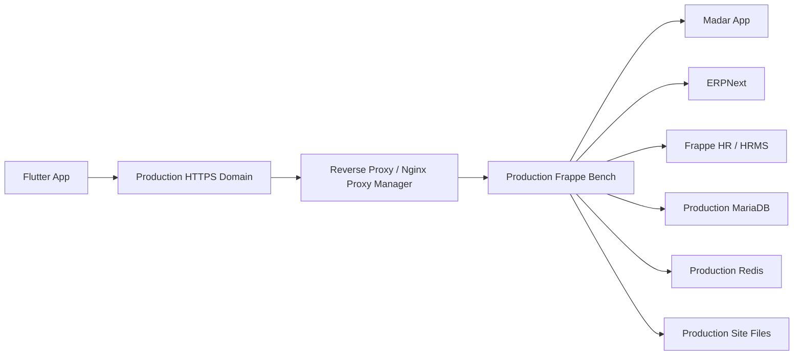

# معمارية الإنتاج

## الهدف

تعمل Madar كطبقة تشغيلية آمنة بين Flutter وبين ERPNext/Frappe HR داخل نفس
منصة Frappe. الإنتاج يجب أن يكون مفصولًا بالكامل عن staging في البيانات،
الأسرار، المستخدمين، والدومينات.

## الشكل العام



## مواقع Frappe

- production يجب أن يكون له site مستقل عن staging.
- staging يبقى لاختبار الإصدارات والبيانات التجريبية.
- لا تشارك قاعدة بيانات واحدة بين staging وproduction.
- لا تشارك `site_config.json` بين البيئتين.

## الدومينات

- staging domain: يستخدم للاختبار فقط.
- production domain: يستخدم للعميل الحقيقي فقط.
- يجب تفعيل SSL/TLS صالح على production قبل أي login حقيقي.
- Reverse proxy يجب أن يمرر Host header الصحيح إلى Frappe.
- إذا كان domain العام لا يطابق اسم site الداخلي، أضف domain داخل Frappe site
  بعد مراجعة التشغيل:

```bash
bench --site <production-site> add-domain <production-domain>
bench restart
```

## البيانات والشركات المحاسبية

- ERPNext في production يجب أن يحتوي على Company وإعدادات محاسبية حقيقية.
- ERPNext في staging قد يحتوي على بيانات اختبار فقط.
- لا تنقل test customers/items/payments إلى production إلا عبر خطة migration
  منفصلة ومعتمدة.
- تحقق من Modes of Payment، الحسابات، العملاء، الأصناف، الضرائب، وسلوك الأسعار
  قبل تفعيل accounting finalization.

## Docker/Bench

النهج المتوقع:

- Docker يستضيف Frappe/ERPNext/HRMS/Madar.
- `frappe-bench/apps/madar` يسحب tag معتمد من Git.
- `bench --site <site> migrate` يطبق DocTypes والpatches.
- `bench restart` يعيد تشغيل الخدمات.

قالب مواقع الملفات، بدون أسرار:

```text
/home/frappe/frappe-bench/apps/madar
/home/frappe/frappe-bench/sites/<production-site>
/home/frappe/frappe-bench/sites/<production-site>/site_config.json
```

## استراتيجية Git

- `main`: آخر كود معتمد.
- staging tags: مثل `v0.2.0-staging-hardened-mvp`.
- production tags: يجب إنشاؤها فقط بعد قبول staging، مثال:

```bash
git tag -a v0.2.0-production -m "production release: hardened MVP"
git push origin v0.2.0-production
```

لا تنشر production من commit عائم بدون tag.

## حدود Flutter

- Flutter يستخدم production domain فقط في build الإنتاجي.
- Flutter لا يستدعي `/api/resource`.
- Flutter لا يحتوي على ERP credentials.
- أي تغيير في endpoint أو base URL يجب أن يمر عبر build configuration آمن، وليس
  hardcoded secrets.
